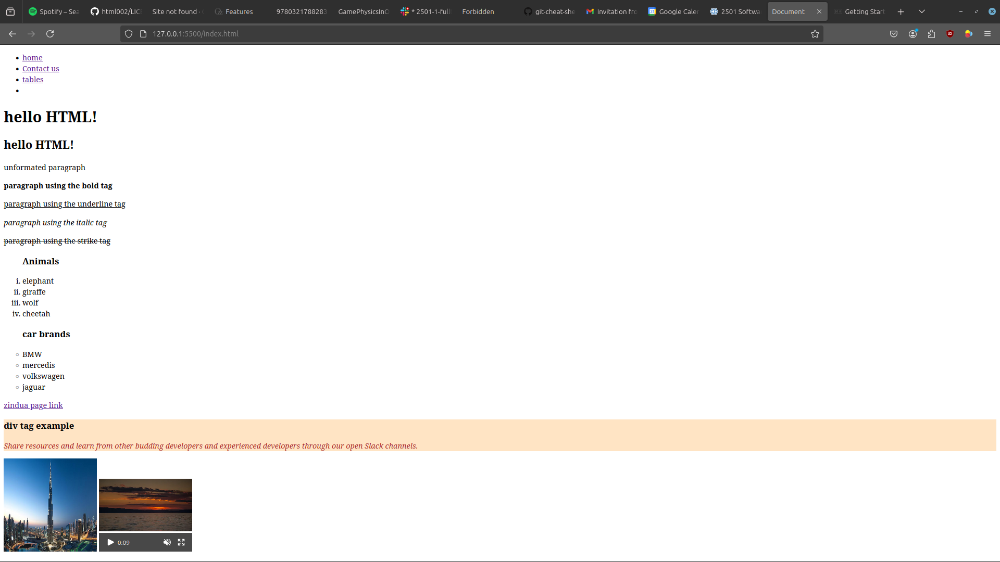

# Learning HTML navigation


a sample of the home page


cloning the code:

```
$ git clone https://github.com/Rythm1c/html002.git


```

pushing the code:

```

$ git add .
$ git commit -m "your message"
$ git push origin main

```